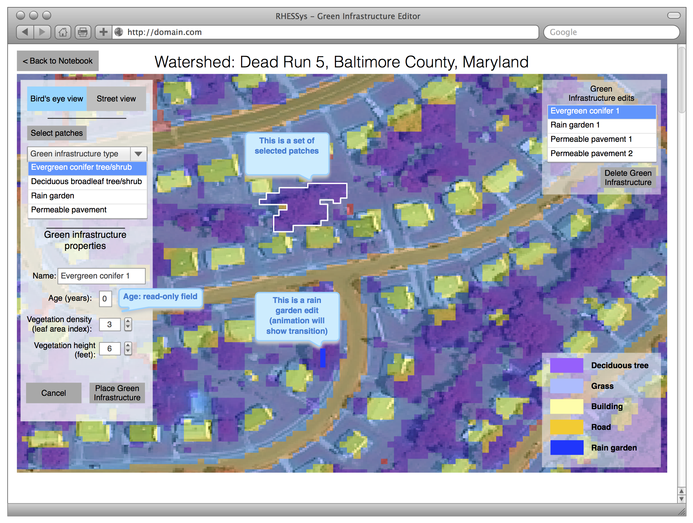
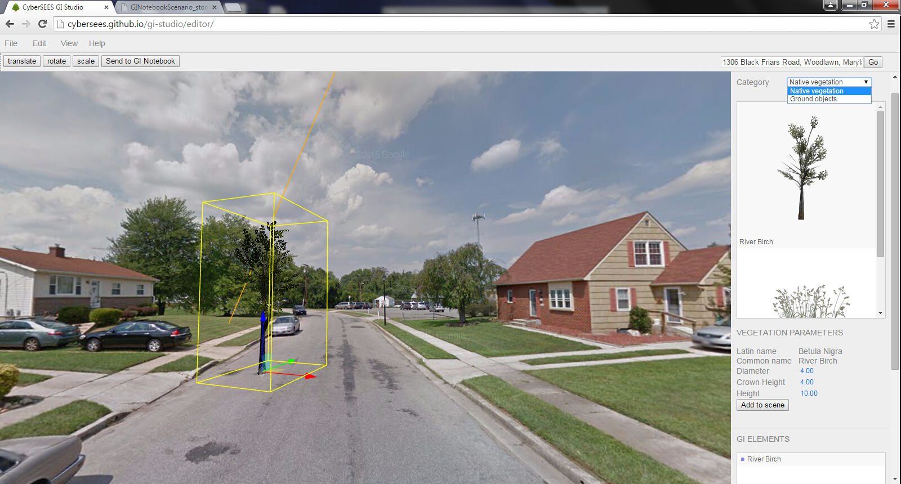

# GI Notebook User Scenario: Stormwater Engineer

## Introduction
Goal: Use GI Notebook to design green infrastructure stormwater
management practices in a watershed, and to test the performance of
these practices using ecohydrologic, cost, and co-benefit models.

Author: Brian Miles

## User
Sam Stormwater Engineer

## Scenario

### Watershed selection
Sam Stormwater Engineer (Sam; the user) wishes to use the *GI
Notebook* to design green infrastructure stormwater management
practices (GI) in a watershed, and to test the performance of these
practices using ecohydrologic, cost, and co-benefit models (models).

Sam starts by loading the *GI Notebook* website.  After logging in
(which may including signing up for an account), Sam is presented with
the *Watershed chooser*, which shows, using list and map view
interfaces, the set of watersheds for which models have been
developed.

The *Watershed chooser* allows Sam to view information about each
watershed (e.g. name, description, watershed area, types of GI
available to place in this watershed, etc. metadata).  The *Watershed
chooser* also lists, for each watershed, any previous *GI Edit
Sessions*, allowing the user to re-open previous sessions, and to
create/view a *GI performance report* for each session.  Additionally,
the *Watershed chooser* allows the user to create a new *GI Edit
Session*.  The list of available watersheds in the *Watershed chooser*
is determined by the watershed models that have been added to the *GI
Notebook* by the system administrators (a future release could allow
users to create new watershed models).

When Sam chooses to view an existing or to create a new *GI Edit
Session* for a particular watershed, Sam is redirected to the *GI
Bird's-eye Editor*, a web-based GIS that loads the geospatial data for
the selected watershed zoomed to the maximum extent of the
watershed. The base layer of the map is high-resolition
satellite/aerial photography, with the following GIS layers overlaid:
watershed boundary (drawn as a polygon with no fill); and the
landcover data as defined in the ecohydrology model (drawn with
transparency so that the underlying imagery is present).  Optionally,
the user can change the base layer to one of the following: hillshade;
or flow accumulation map.  The location of previously placed GI (for
existing edit sessions) or newly placed GI will be indicated on the
plan-view map using the polygons that define the GI area; these
polygons will be filled with the 2D overhead view icons associated
with each green infrastructure type.

Figure 1. Bird's-eye view editor.

### Placing green infrastructure in bird's-eye view
Within the bird's-eye view (Figure 1) Sam can use "slippy map" controls 
(i.e. panning and zooming) to navigate to the sub region of the watershed 
in which Sam would like to place green infrastructure storm water 
management practices.  Once the user finds the sub region they would 
like to work in, they can place green infrastructure (GI) elements in 
the watershed as follows:

1. Tap or click on the *Select patches* button;

2. Draw a polygon outlining the model patches where the GI will be
placed (each GI edit will be associated with a single polygon);

3. Select the GI type to place in this polygon;

4. Adjust the GI properties (e.g. name, vegetation density);

5. Tap or click on the *Place Green Infrastructure* button (or tap or
click on the *Cancel* button, which will erase the polygon).  This
results in the GI being saved by the *GI Notebook*.

Once the new GI has been placed, it will appear under its user-chosen
name in the list of *Green Infrastructure edits*; when an element of
this list is selected, the GI polygon associated with the edit will be
highlighted.  If the polygon does not entirely lie within the current
viewport, the GI editor will gracefully pan to ensure that the entire
polygon is in view (plus a small area just beyond the polygon so that
it is clear to the user that the entire polygon is in view).

The *Green Infrastructure edits* listing will also allow the user to
select one or more GI edits, which will highlight them on the map
(with necessary panning, as above, and zooming to ensure all edits are
visible in the viewport).  Once selected, the user can delete the
edits by tapping or clicking on the *Delete Green Infrastructure*
button in the *Green Infrastructure edits* listing.

### Placing green infrastructure in street view 

Figure 2. street view editor.

In the street view editor(Figure 2), users can place green infrastructure 
objects in the street view as follows:

1. Select *Native vegetation* in the *Category* drop-down menu.

2. Choose the type of native vegetation by clicking on its image.

3. Click on the *Add to scene* button or drag and drop.

4. Place the tree in the right place of street view.
To navigate to the target area where users would like to place green 
infrastructure objects, users could click and drag their mouse to orient
the street view and scroll with their mouse to zoom in and out. After this,
users could click and drag the objects to there.

5. Adjust the vegetation parameters (e.g. diameter, height, name etc.);

6. Click on the *Send to GI Notebook* button to save the GI in the GI 
Notebook (or hit the *delete* key, which will delete it).

All placed green infrastructure objects will appear in the list of 
*GI elements*. When an element of this list is selected, the associated 
3D model will be highlighted in a cuboid mesh.

The *GI elements* list also allows users to select multiple GI 
elements and do editing for multiple elements simultaneously.

### Creating a green infrastructure performance report
TBD
